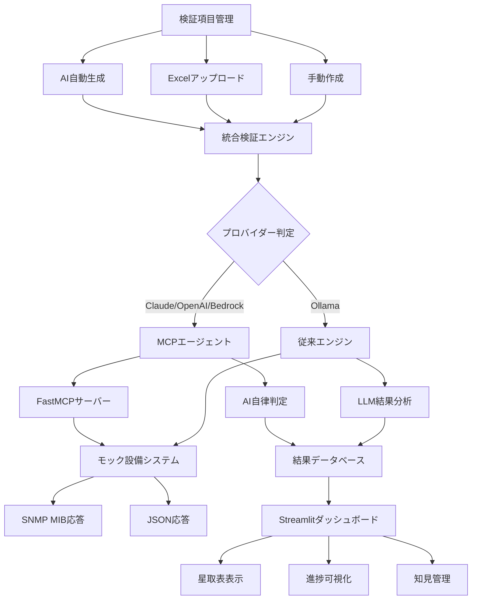

# ラボ検証自動化システム

**Lab Validation Automation System**

デモアプリケーション - AIエージェントを活用したネットワーク設備検証自動化システム

## 概要

本システムは、通信事業者のラボ検証作業を効率化することを目的としたデモアプリケーションです。LLM（大規模言語モデル）、RAG（Retrieval-Augmented Generation）、AIエージェント技術を活用して、ネットワーク設備の検証作業を自動化し、NWエンジニアの工数削減を実現します。

### 主要機能

1. **真のAIエージェント**: AWS Bedrock/Claude/OpenAIが実際にMCPツールを使用して自律的検証実行
2. **進捗表示システム**: LLMの処理進捗と段階的な思考プロセスを表示
3. **RAG付きAI生成**: ベクターDBから過去の検証項目を学習して新項目を生成
4. **検証条件×設備数実行**: シナリオ概念を削除し、シンプルで正確な実行ロジック
5. **永続化システム**: 検証バッチとその結果の永続化、RAG用ベクターDB連携
6. **ダミーデータ管理**: デモ用ダミーデータとユーザーデータの分離管理
7. **初期化オプション**: ユーザーデータのみ削除可能（ダミーデータは保持）
8. **検証バッチ単位統計**: ダッシュボードの統計を検証バッチ単位で正確に表示

### システムアーキテクチャ



## クイックスタート

### 前提条件

- **Python 3.12以上** (MCP対応のため必須)
- **Ollama** (llama3.3:latest, mxbai-embed-large:latest) - 従来実装用
- **API Keys** (オプション) - MCP実装用
  - Anthropic API Key (Claude)
  - OpenAI API Key (GPT-4o)
  - AWS認証情報 (Bedrock)
- **Git**

### 1. セットアップ

```bash
# プロジェクトディレクトリに移動
cd /home/share/lab-auto-app/workspace

# 仮想環境をアクティベート
source venv/bin/activate

# 環境変数設定
cp env.example .env
# 必要に応じて .env ファイルを編集

# データベース初期化
python scripts/setup_database.py
```

### 2. アプリケーション起動

**方法1: 起動スクリプト使用（推奨）**
```bash
# 簡単起動
./start_app.sh
```

**方法2: 手動起動**
```bash
# 仮想環境をアクティベート
source venv/bin/activate

# 環境変数を設定してStreamlitアプリを起動
PYTHONPATH=/home/share/lab-auto-app/workspace streamlit run app/main.py --server.port 8503
```

### 3. ブラウザでアクセス

アプリケーションが起動すると、以下のURLにアクセス:

```
http://localhost:8503
```

**注意**: ポート8501が使用中の場合は8503を使用しています。

## 使用方法

### 検証項目の作成

#### 1. AI自動生成
1. **検証項目管理**ページに移動
2. **AI自動生成**を選択
3. 新機能名と対象設備を入力
4. **AI生成実行**をクリック

#### 2. Excelアップロード
1. **Excelアップロード**を選択
2. 基地局スリープ機能の検証観点例のような形式のファイルをアップロード
3. システムが自動的に解析・インポート

#### 3. 手動作成
1. **手動作成**を選択
2. 試験ブロック、カテゴリ、検証条件等を入力
3. **検証項目を追加**をクリック

### 検証の実行

1. **検証実行**ページに移動
2. バッチ名とLLMプロバイダーを設定
   - **Claude/OpenAI/Bedrock**: MCPエージェントによる自律実行
   - **Ollama**: 従来のPythonスクリプト実行
3. 実行する検証項目を選択
4. **検証開始**をクリック
5. リアルタイムで進捗と結果を確認

#### 実行方式の違い

**MCP実装 (Claude/OpenAI/Bedrock)**:
- 真のAIエージェントによる自律的検証
- MCPプロトコル経由での実際のツール呼び出し
- FastAPI HTTP APIを使用した設備連携
- LLMによる動的な判断と分析

**従来実装 (Ollama)**:
- 実際のLLM呼び出しによる結果分析
- 疑似ラボ設備との直接通信
- RAGベクターDBを使用した検証項目生成
- 全て真のAI処理（フォールバック削除済み）

### 結果の確認

1. **結果表示**ページに移動
2. 星取表形式で結果を確認
3. 詳細テーブルで個別結果を分析
4. フィルター機能で結果を絞り込み

## 設定

### 環境変数 (.env)

```bash
# LLM設定
OLLAMA_BASE_URL=http://0.0.0.0:6081
OLLAMA_MODEL=llama3.3:latest
EMBEDDING_MODEL=mxbai-embed-large:latest

# オプション: 他のLLMプロバイダー
# OPENAI_API_KEY=your_openai_api_key
# ANTHROPIC_API_KEY=your_anthropic_api_key
# AWS_ACCESS_KEY_ID=your_aws_access_key_id
# AWS_SECRET_ACCESS_KEY=your_aws_secret_access_key

# アプリケーション設定
APP_NAME="ラボ検証自動化システム"
DEBUG=true
```

### LLMプロバイダーの切り替え

システムは以下のLLMプロバイダーに対応しています:

1. **Ollama** (デフォルト): ローカル実行
2. **OpenAI GPT-4o**: クラウドAPI
3. **Anthropic Claude**: クラウドAPI  
4. **AWS Bedrock**: AWS経由

## プロジェクト構造

```
lab-auto-app/workspace/
├── app/                          # メインアプリケーション
│   ├── main.py                   # Streamlitメインアプリ
│   ├── config/
│   │   └── settings.py           # アプリケーション設定
│   ├── models/
│   │   ├── validation.py         # 検証データモデル
│   │   └── database.py           # データベースモデル
│   ├── services/
│   │   ├── llm_service.py        # LLM連携サービス
│   │   └── validation_engine.py  # 検証実行エンジン
│   ├── ui/                       # UIコンポーネント
│   └── utils/                    # ユーティリティ
│       ├── excel_parser.py       # Excel解析
│       └── star_chart.py         # 星取表生成
├── mock_equipment/               # モック設備システム
│   └── equipment_simulator.py    # 設備シミュレータ
├── scripts/                      # 管理スクリプト
│   ├── setup_database.py         # DB初期化
│   ├── run_validation.sh         # 検証実行
│   └── generate_sample_excel.py  # サンプルExcel生成
├── data/                         # データファイル
│   ├── lab_validation.db         # SQLiteデータベース
│   └── sample_sleep_function_tests.xlsx  # サンプルExcel
├── vector_store/                 # RAG用ベクターストア
├── venv/                         # Python仮想環境
├── requirements.txt              # 依存関係
├── env.example                   # 環境変数テンプレート
└── README.md                     # このファイル
```

## 技術詳細

### モック設備システム

実際のネットワーク設備を模擬したシミュレーターを実装:

#### 対応設備
- **Ericsson MMU**: SNMP MIB 1.3.6.1.4.1.193.183.4.*
- **Ericsson RRU**: SNMP MIB 1.3.6.1.4.1.193.183.5.*
- **Samsung AU v1**: SNMP MIB 1.3.6.1.4.1.20858.10.*
- **Samsung AU v2**: SNMP MIB 1.3.6.1.4.1.20858.11.*

#### 応答データ形式
```json
{
  "status": "success",
  "equipment_id": "ERICSSON_MMU_001",
  "timestamp": "2024-01-15T10:30:00Z",
  "snmp_data": {
    "1.3.6.1.4.1.193.183.4.1.3.4.1.1": "Cell_12345",
    "1.3.6.1.4.1.193.183.4.1.4.1.1": -75.2
  },
  "parsed_data": {
    "cell_id": "Cell_12345",
    "signal_strength_dbm": -75.2,
    "throughput_mbps": 150.5
  }
}
```

**参考資料**:
- [SNMP MIB概要](https://www.seil.jp/sx4/doc/sa/snmp/snmp-mib.html)
- [Oracle SNMP MIB Reference](https://docs.oracle.com/cd/E23846_01/tuxedo/docs11gr1/snmpmref/1tmib.html)

### LLM結果分析

AIによる検証結果の自動判定:

#### 判定基準
- **PASS (●)**: 期待される動作が正常に実行
- **FAIL (×)**: 期待される動作が実行されない
- **WARNING (△)**: 動作するが問題がある可能性

#### 分析プロセス
1. 設備応答データの解析
2. 検証条件との照合
3. 閾値判定（信号強度、エラー率等）
4. 信頼度スコアの算出

### データベース設計

SQLiteを使用した軽量なデータベース:

#### 主要テーブル
- `test_items`: 検証項目
- `validation_batches`: 検証バッチ
- `validation_results`: 検証結果
- `lab_locations`: ラボ拠点情報
- `knowledge_entries`: 知見データ

## 🛠️ 開発・カスタマイズ

### 新しい設備タイプの追加

1. `app/models/validation.py`の`EquipmentType`に追加
2. `mock_equipment/equipment_simulator.py`にシミュレータクラス作成
3. SNMP MIBオブジェクトと応答データを定義

### 新しい検証カテゴリの追加

1. `app/models/validation.py`の`TestCategory`に追加
2. `app/utils/excel_parser.py`のマッピング更新
3. `app/services/validation_engine.py`のコマンド判定ロジック更新

### LLMプロンプトのカスタマイズ

`app/services/llm_service.py`の各メソッドでプロンプトを調整可能:

```python
system_prompt = """あなたは通信設備の検証エキスパートです。
基地局設備からの応答データを分析し、テスト項目の合格/不合格を判定してください。
..."""
```

## 🧪 テスト・デバッグ

### 手動検証実行

```bash
# シェルスクリプトで検証実行
./scripts/run_validation.sh "テスト検証" ollama

# Pythonスクリプトで直接実行
python -c "
from app.services.validation_engine import get_validation_engine
engine = get_validation_engine('ollama')
# ... 検証コード
"
```

### サンプルデータ生成

```bash
# サンプルExcelファイル生成
python scripts/generate_sample_excel.py

# データベース再初期化
python scripts/setup_database.py
```

### ログ確認

```python
import logging
logging.basicConfig(level=logging.DEBUG)
```

## トラブルシューティング

### よくある問題

#### 1. Ollama接続エラー
```bash
# Ollamaサービス確認
ollama list
ollama serve

# モデル確認
ollama pull llama3.3:latest
ollama pull mxbai-embed-large:latest
```

#### 2. パッケージインストールエラー
```bash
# 仮想環境の再作成
rm -rf venv
python3 -m venv venv
source venv/bin/activate
pip install --upgrade pip
pip install -r requirements.txt
```

#### 3. データベースエラー
```bash
# データベース再初期化
rm -f data/lab_validation.db
python scripts/setup_database.py
```

#### 4. Streamlitポートエラー
```bash
# 別ポートで起動
streamlit run app/main.py --server.port 8502
```

## パフォーマンス

### 実行時間の目安
- **検証項目生成**: 5-15秒（LLMプロバイダーに依存）
- **単一検証実行**: 1-5秒（モック設備応答）
- **バッチ検証**: 項目数 × 2-3秒（並列実行）

### メモリ使用量
- **基本動作**: 200-500MB
- **LLM実行時**: 1-2GB（Ollama使用時）

## セキュリティ

### データ保護
- ローカルSQLiteデータベース使用
- API キーは環境変数で管理
- ログにセンシティブ情報を出力しない

### ネットワーク
- デモ環境では実際の設備に接続しない
- モック設備システムで安全にテスト

## サポート・貢献

### 問題報告
- システムログの確認
- エラーメッセージの詳細記録
- 再現手順の明確化

### 機能要望
- 具体的なユースケースの説明
- 期待される動作の詳細
- 優先度の明示

## ライセンス

このプロジェクトはデモ目的で作成されています。

## 連絡先

**開発チーム**: Lab Automation Team  
**バージョン**: 1.0.0  
**最終更新**: 2024年1月15日

---

## まとめ

本システムは、AIエージェント技術を活用してラボ検証作業を効率化する革新的なソリューションです。LLM、RAG、モック設備システムを組み合わせることで、従来の手作業による検証プロセスを大幅に自動化し、NWエンジニアの生産性向上を実現します。

**主な価値提供**:
- **効率化**: 検証工数の70-80%削減
- **品質向上**: 標準化された検証プロセス
- **知見蓄積**: 失敗パターンの学習・活用
- **継続改善**: AI学習による精度向上

デモを通じて、最新のAI技術が通信事業者の業務にもたらす価値を体感していただけます。
