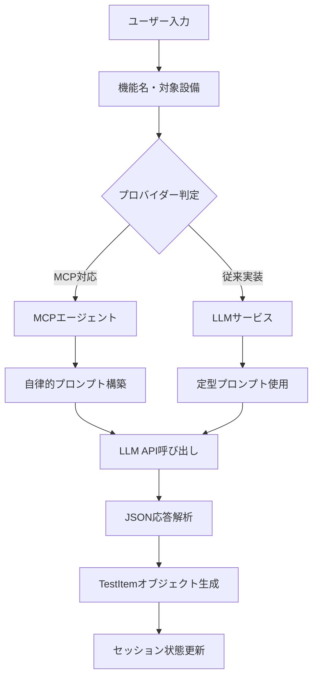
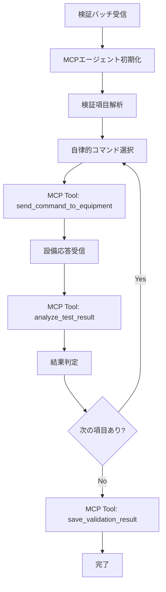
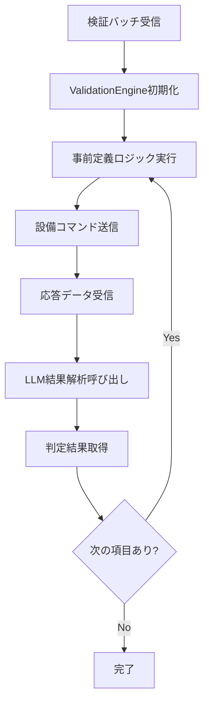

# AIエージェント詳細仕様書

## 概要

本システムでは、LLM（大規模言語モデル）を活用したAIエージェントが複数の箇所で使用されています。本文書では、各機能でのAIエージェントの役割、実行フロー、プロンプト設計、期待する出力について詳細に説明します。

## 1. AIエージェントの使用箇所

### 1.1 検証項目自動生成（AI自動生成）
**場所**: 検証項目管理 > AI自動生成  
**対応プロバイダー**: 全プロバイダー（Ollama, OpenAI, Anthropic, AWS Bedrock）  
**実行方式**: 
- MCP対応（OpenAI, Anthropic, Bedrock）: 自律的判断
- 従来実装（Ollama）: スクリプトベース

### 1.2 検証実行エンジン
**場所**: 検証実行 > 検証開始  
**対応プロバイダー**: 全プロバイダー  
**実行方式**: 
- MCP対応: AIエージェントが自律的にコマンド選択・実行
- 従来実装: 事前定義ロジック + LLM結果解析

### 1.3 結果解析・判定
**場所**: 検証実行中の結果判定  
**対応プロバイダー**: 全プロバイダー  
**実行方式**: 設備応答データをLLMが解析してPASS/FAIL/WARNINGを判定

## 2. 検証項目自動生成の詳細

### 2.1 実行フロー



### 2.2 プロンプト設計

#### 基本プロンプト構造
```
あなたはネットワーク設備の検証項目を生成する専門家です。

【入力情報】
- 機能名: {feature_name}
- 対象設備: {equipment_types}

【生成要件】
1. 正常系、準正常系、異常系の検証条件を含む
2. 各設備タイプに適した検証内容
3. 実際のラボ検証で実行可能な項目
4. 基地局スリープ機能の検証観点を参考

【出力形式】
JSON配列で以下の形式:
[
  {
    "test_block": "機能ブロック名",
    "condition_text": "具体的な検証条件"
  }
]
```

#### MCP対応プロバイダーの拡張プロンプト
```
【追加指示】
- 過去の検証データベースを参照して類似項目を確認
- 設備固有の制約事項を考慮
- リスク評価に基づく優先度設定
```

### 2.3 期待する出力

```json
[
  {
    "test_block": "基地局スリープ機能",
    "condition_text": "スリープモード移行時のCMデータ取得（正常系・準正常系・異常系を含む）"
  }
]
```

## 3. 検証実行エンジンの詳細

### 3.1 MCP実装（自律実行）

#### 実行フロー


#### 使用するMCPツール

1. **get_test_items()**
   - 目的: データベースから検証項目一覧を取得
   - 入力: なし
   - 出力: TestItem配列

2. **send_command_to_equipment(equipment_id, command, parameters)**
   - 目的: 指定設備にコマンドを送信
   - 入力: 設備ID、コマンド名、パラメータ
   - 出力: 設備応答データ

3. **analyze_test_result(test_item_id, equipment_response, expected_criteria)**
   - 目的: 設備応答を解析してPASS/FAIL/WARNING判定
   - 入力: テスト項目ID、設備応答、期待値
   - 出力: 判定結果と信頼度

4. **save_validation_result(validation_result)**
   - 目的: 検証結果をデータベースに保存
   - 入力: ValidationResultオブジェクト
   - 出力: 保存成功/失敗

#### MCPエージェントプロンプト
```
あなたはラボ検証自動化システムのAIエージェントです。
MCPツールを使用して以下の検証を実行してください。

【検証項目】
{test_items_summary}

【実行手順】
1. get_test_items()で詳細な検証項目を取得
2. 各項目について適切なコマンドを判断
3. send_command_to_equipment()で設備にコマンド送信
4. analyze_test_result()で応答を解析
5. save_validation_result()で結果を保存

【判断基準】
- 正常系: 期待値通りの応答
- 異常系: エラーまたは期待値外の応答

自律的に最適なコマンドを選択し、効率的に検証を実行してください。
```

### 3.2 従来実装（スクリプトベース）

#### 実行フロー


#### 結果解析プロンプト
```
以下の設備応答データを解析して、検証結果を判定してください。

【検証条件】
{condition_text}

【期待値】
{expected_criteria}

【設備応答】
{equipment_response}

【判定基準】
- PASS: 期待値を満たしている
- FAIL: 期待値を満たしていない

JSON形式で以下を出力:
{
  "result": "PASS|FAIL",
  "confidence": 0.0-1.0,
  "reason": "判定理由",
  "details": "詳細分析"
}
```

## 4. 設備応答データ形式

### 4.1 SNMP MIB形式（基地局設備）
```json
{
  "mib_data": {
    "1.3.6.1.4.1.193.183.4.1.3.1": "active",
    "1.3.6.1.4.1.193.183.4.1.3.2": "sleeping",
    "1.3.6.1.4.1.193.183.4.1.4.1": 85,
    "1.3.6.1.4.1.193.183.4.1.4.2": 12
  },
  "timestamp": "2024-01-15T10:30:00Z",
  "equipment_id": "ERICSSON_MMU_001"
}
```

### 4.2 JSON API形式（モダン設備）
```json
{
  "status": "success",
  "data": {
    "power_state": "sleep_mode",
    "cm_data": {
      "cell_count": 85,
      "active_users": 12,
      "throughput_mbps": 156.7
    },
    "performance_metrics": {
      "cpu_usage": 15.2,
      "memory_usage": 45.8,
      "temperature": 42.1
    }
  },
  "metadata": {
    "collection_time": "2024-01-15T10:30:00Z",
    "equipment_type": "SAMSUNG_AUV1"
  }
}
```

## 5. 実行時間とパフォーマンス

### 5.1 各段階の想定時間
- **検証項目生成**: 3-5秒（プロバイダーにより異なる）
- **単一検証実行**: 1-3秒（模擬環境）
- **結果解析**: 0.5-1秒
- **バッチ全体**: 検証項目数 × 2-4秒

### 5.2 MCP vs 従来実装の比較

| 項目 | MCP実装 | 従来実装 |
|------|---------|----------|
| 自律性 | 高（AIが判断） | 低（事前定義） |
| 柔軟性 | 高（動的対応） | 中（設定変更要） |
| 実行速度 | 中（判断時間含む） | 高（直接実行） |
| エラー処理 | 高（自律回復） | 中（定義済み処理） |
| デバッグ性 | 低（ブラックボックス） | 高（ログ詳細） |

## 6. 今後の拡張予定

### 6.1 学習機能
- 過去の検証結果から最適なコマンド選択を学習
- 失敗パターンの自動検出と回避

### 6.2 マルチエージェント協調
- 複数のAIエージェントが並列で検証実行
- 設備間の依存関係を考慮した実行順序最適化

### 6.3 リアルタイム適応
- 設備状態の変化に応じた検証項目の動的調整
- 異常検知時の自動エスカレーション

## 7. トラブルシューティング

### 7.1 よくある問題
1. **API認証エラー**: 環境変数の設定確認
2. **MCP接続失敗**: FastMCPサーバーの起動状態確認
3. **結果解析失敗**: プロンプトの見直しとフォールバック処理

### 7.2 デバッグ方法
- ログレベルをDEBUGに設定
- 各段階の中間結果を確認
- プロバイダー別の動作比較

---

本文書は、システムの理解と今後の改善に活用してください。

